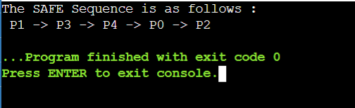

# OS-EX.8-IMPLEMENTATION-OF-BANKER-S-ALGORITHM

## AIM:
To Implement Banker’s Algorithm.
## ALGORITHM:
1.	Initialize variables: Initialize an f array of size n to all zeros, calculate the need matrix, and initialize a y variable to zero.
2.	Iterate over processes: For each process i: If process i has not finished executing, check if all of the resources that process i needs are available. If so: 
	i.Set f[i] = 1 to indicate that process i has finished executing.
	ii.Add process i to the ans array.
	iii.Update the avail array to reflect the fact that process i has finished executing.
3.	Check if all processes have finished executing: If all of the elements of the f array are equal to one, then all of the processes have finished executing and the system is safe.
4.	Print the SAFE Sequence: If the system is safe, print the SAFE Sequence.
5.	Print a message indicating that the system is not safe: If the system is not safe, print a message indicating that the system is not safe.

## PROGRAM:
~~~
#include <stdio.h>
int main()
{
	int n, m, i, j, k;
	n = 5; 
	m = 3; 
	int alloc[5][3] = { { 0, 1, 0 },{ 2, 0, 0 }, { 3, 0, 2 }, { 2, 1, 1 },{ 0, 0, 2 } }; 
	int max[5][3] = { { 7, 5, 3 }, { 3, 2, 2 },{ 9, 0, 2 }, { 2, 2, 2 }, { 4, 3, 3 } }; 
	int avail[3] = { 3, 3, 2 }; 
	int f[n], ans[n], ind = 0;
	for (k = 0; k < n; k++) 
	{
		f[k] = 0;
	}
	int need[n][m];
	for (i = 0; i < n; i++) 
	{
		for (j = 0; j < m; j++)
			need[i][j] = max[i][j] - alloc[i][j];
	}
	int y = 0;
	for (k = 0; k < 5; k++) 
	{
		for (i = 0; i < n; i++) 
		{
			if (f[i] == 0) 
			{
				int flag = 0;
				for (j = 0; j < m; j++) 
				{
					if (need[i][j] > avail[j])
					{
						flag = 1;
						break;
					}
				}
				if (flag == 0) 
				{
					ans[ind++] = i;
					for (y = 0; y < m; y++)
						avail[y] += alloc[i][y];
					f[i] = 1;
				}
			}
		}
	}
	int flag = 1;
	for(int i=0;i<n;i++)
	{
	if(f[i]==0)
	{
		flag=0;
		printf("The following system is not safe");
		break;
	}
	}
	if(flag==1)
	{
	printf("The SAFE Sequence is as follows : \n");
	for (i = 0; i < n - 1; i++)
		printf(" P%d ->", ans[i]);
	printf(" P%d", ans[n - 1]);
	}
	return (0);
} 

~~~
## OUTPUT:

## RESULT:
Thus ,Banker’s Algorithm is successfully implemented using C programming.

